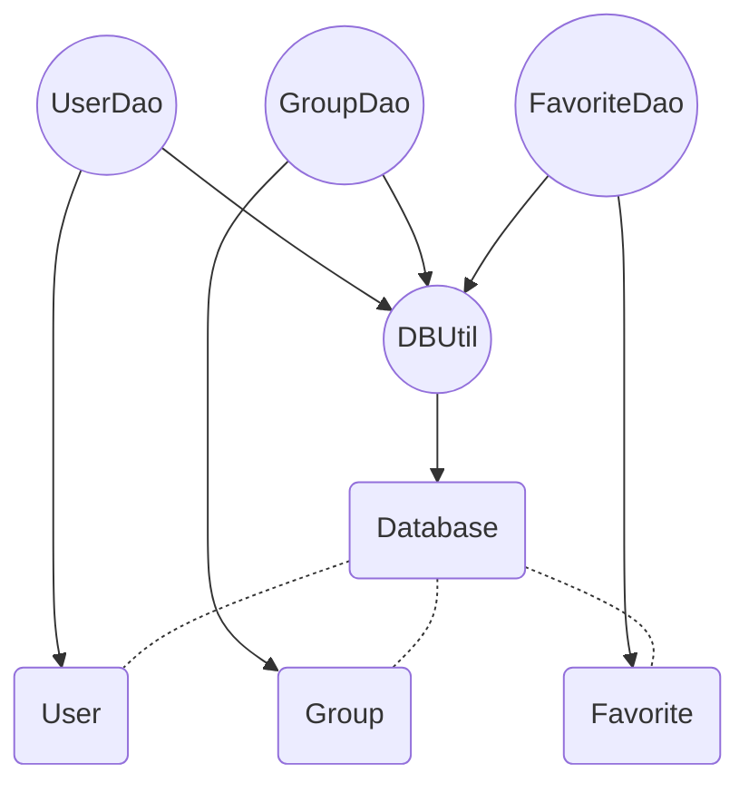

# Lab4 Database Test

常朝坤 16307130138

2019/6/2

## 测试说明

### 单元介绍

本单元为数据库单元，主要功能是为数据库的操作提供一系列接口。本单元在设计上采用了DAO模式，为三个数据库表user,group,favorite分别涉及了module和DAO操作类。并通过DBUtil类提供数据库的连接，增删查改等操作。单元结构图如下：



#### 测试类

- DBUtil：数据库的连接查询等操作
- UserDao：数据库表User对应的DAO模型类
- GroupDao：数据库表Group对应的DAO模型类
- FavoriteDao：数据库表Favorite对应的DAO模型类

#### 测试依赖

DAO类的测试依赖于DBUtil类。所以要先测试DBUtil，再测试DAO类。由于三个Dao模型在变量和逻辑上几乎完全相同，所以考虑篇幅关系，本报告中只展示针对UserDao的测试。

*另外DBUtil类依赖于DBConfiguration类，但是该类只有有关数据库连接的属性，所以不进行测试，默认其正确无误。*

#### 测试方法

由于是针对数据库进行的测试，涉及到了数据库的增删查改，使用junit相对会比较复杂，且对数据库状态有影响。所以本单元的测试采用了更专业的工具DBUnit。

## 测试内容

### DBUtil Test

#### getConnection

```java
public static Connection getConnection() throws SQLException{}
```

##### 测试种类

简单测试，测试连接的正确性。

##### 测试代码

连接的测试和下面的doQuery测试合在一起了，因为任何一次数据库操作都需要先连接。

#### doQuery

```java
public ResultSet doQuery(String sql, Object[] params){}
```

##### 流程图


##### 判定

**select name from user where id<5 or group is NULL** 

- condition 1 : id<5
- condition 2: group is NULL

##### 测试种类

白盒测试——条件组合覆盖

##### 测试逻辑

在不同的数据库状态下执行上述Query，验证输出结果的正确性。

##### 测试与结果

*输入即为数据库的不同状态，下面的每一个data.xml里都有且仅有一条数据，数据在下方第二个表格列出。*

| 测试数据   | 预期结果 | 路径 | c1   | c2   | 测试结果 |
| ---------- | -------- | ---- | ---- | ---- | -------- |
| data1.xml  | cck      | a    | t    | t    | 通过     |
| data2.xml  | hcy      | a    | t    | f    | 通过     |
| data3.xml  | zzg      | a    | f    | t    | 通过     |
| data4.xmlx | NULL     | b    | f    | f    | 通过     |

| data      | column id | column user_type | column name | column passwd | column groups |
| :-------- | --------- | ---------------- | ----------- | ------------- | ------------- |
| data1.xml | 1         | 0                | cck         | cck           | NULL          |
| data2.xml | 2         | 0                | hcy         | hcy           | 1,2           |
| data3.xml | 6         | 0                | zzg         | zzg           | NULL          |
| data4.xml | 7         | 0                | xbh         | xbh           | 1,2           |

#### doUpdate

```java
public int doUpdate(String sql, Object[] params){}
```

##### 流程图


##### 判定

decision 1 : len(passwd) < 5

decision 2 : user_type == 0

##### 测试逻辑

在不同的数据库状态下，运行上述流程，检查数据库的状态是否符合预期。其中：

p1 = 11111

p2 = 12345

##### 测试种类

白盒测试——判定覆盖

##### 测试与结果

| 测试数据  | 预期结果                | 路径 | d1   | d2   | 测试结果 |
| --------- | ----------------------- | ---- | ---- | ---- | -------- |
| data5.xml | cck.passwd = p1         | a    | t    | t    | 通过     |
| data6.xml | cck.passwd = p2         | b,c  | f    | t    | 通过     |
| data7.xml | cck.passwd = cck.passwd | b,d  | f    | f    | 通过     |

| data      | column id | column user_type | column name | column passwd | column groups |
| :-------- | --------- | ---------------- | ----------- | ------------- | ------------- |
| data5.xml | 1         | 0                | cck         | cck           | NULL          |
| data6.xml | 2         | 0                | cck         | cckcck        | NULL          |
| data7.xml | 3         | 1                | cck         | cckcck        | NULL          |

------

*由于Dao模型的方法逻辑实际上就是调用DBUtil的各个方法，所以对这里的测试也比较简单，不涉及分支等结构，大部分都是检验操作的正确性。所以下面的测试中就只展示部分较为复杂的几个测试，对于简答的只展示一个。*

### UserDao Test

#### add

```java
public boolean add(User u){}
```

##### 流程图

无

##### 测试逻辑

创建一个User类，调用UserDAO.add方法，在数据库中插入一个元组。调用DBUtil.doQuery查看结果是否存在。

##### 测试种类

简单测试，测试方法的正确性。

##### 测试与结果

**Input：**

| id   | user_type | name     | passwd   | groups |
| ---- | --------- | -------- | -------- | ------ |
| 1000 | 2         | demo_add | demo_add | NULL   |

**After execute DBUtil.doQuery("select * from user where id==1000",null)**

| id   | user_type | name     | passwd   | groups |
| ---- | --------- | -------- | -------- | ------ |
| 1000 | 2         | demo_add | demo_add | NULL   |


#### delete

```java
public boolean delete(int id){}
```

简单测试，逻辑可与add结合，先add一个元组，再删掉，看数据库是否有变化。

#### update

```java
public boolean update(User u){}
```

简单测试，逻辑与add类似。update一个元组，再利用DBUtil.doQuery查看结果是否是期望的更新。

**Input**

| id   | user_type | name     | passwd              | groups |
| ---- | --------- | -------- | ------------------- | ------ |
| 1000 | 2         | demo_add | demo_add_new_passwd | NULL   |

**After execute DBUtil.doQuery("select * from user where id==1000",null)**

| id   | user_type | name     | passwd              | groups |
| ---- | --------- | -------- | ------------------- | ------ |
| 1000 | 2         | demo_add | demo_add_new_passwd | NULL   |

#### get

```java
public User get(int id,String password){}
```

##### 流程图


##### 判定

decision 1 : passwd == user[id].passwd

##### 测试逻辑

不同的id+passwd输入，测试上述结果是否符合预期。

##### 测试种类

白盒测试——语句覆盖

##### 测试与结果

数据库（data8.xml）状态如下：

| data      | column id | column user_type | column name | column passwd | column groups |
| :-------- | --------- | ---------------- | ----------- | ------------- | ------------- |
| data8.xml | 1         | 0                | cck         | cck           | NULL          |

| 测试数据         | 预期结果               | 路径 | d1   | 测试结果 |
| ---------------- | ---------------------- | ---- | ---- | -------- |
| id=1, passwd=cck | User(1,0,cck,cck,NULL) | a    | t    | 通过     |
| id=1, passwd=hcy | null                   | b    | f    | 通过     |